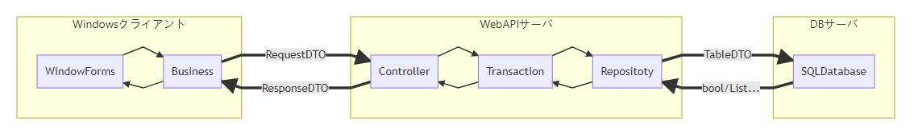

# TinyServerClientFramework
WindowsクライアントとWebAPIサーバーの簡易フレームワーク

# Getting Started
1. StarterKitをコピーする
1. フォルダ名をStarterKitから任意のフォルダ名にリネームする
1. ```Tools/テーブルDTO生成ツール.bat```でDB(SQLServer/PostgeSQL/SQLite)からTableDTO・WebAPI用テストデータ作成クラスを自動生成する
1. ```Toolsソースコード生成ツール.bat```で画面IDを指定し、下記のファイルを自動生成する  
    * クライアント
       * フォームクラス(Designerファイル含む)
       * Bussinessクラス(コンストラクタ)
    * WebAPI
       * Contorllerクラス(コンストラクタ)
       * Transactionクラス(コンストラクタ)
       * Repositoryクラス(コンストラクタ)
    * WebAPITest
       * Testクラス(コンストラクタ)
1. ```Toolsソースコード生成ツール.bat```で画面ID、機能ID(処理名)を指定し、下記のファイルを自動生成する  
    * クライアント
       * Bussinessクラス(機能IDメソッド)
    * WebAPI
       * Contorllerクラス(機能IDメソッド)
       * Transactionクラス(機能IDメソッド)
       * Repositoryクラス(機能IDメソッド)
    * WebAPITest
       * Testクラス(機能IDメソッド)
    * DataTransferObjects
       * Requestクラス(機能ID専用)
       * Responseクラス(機能ID専用)
1. TODOコメント部分の実装を行う
1. フォームのイベントメソッドでBussinessインスタンス生成とメソッド呼び出しを実装する

※クライアントはダミーフォーム```Sample```が設定されているため、初期表示したいフォームに切り替えること
* ダミーフォーム```Sample```を削除
* ```Client/Program.cs```の初期化フォームの変更  
  ```
  Application.Run(new Sample());
    ↓
  Application.Run(new 初期表示フォーム名());
  ```

# フレームワーク概要  
 
 ## Windowsクライアント  
  * WindowForms  
    WindowsクライアントのUI部分  
    主な機能
    * 画面表示
    * 入力受付・値の検証
    * Bussinessのデータ問合せ処理・更新処理呼び出し
  * Bussiness  
    Windowsクライアントのビジネスロジック部分  
    主な機能
    * WebAPIのデータ問合せ処理・更新処理呼び出し

 ## WebAPIサーバー  
   * Controller  
     Windowsクライアントと通信するWebAPIのエンドポイント  
     主な機能
     * リクエストデータの検証
     * Transaction生成
     * 対象処理の呼び出し
     * 呼び出し結果をWindowsクライアントに返す
   * Transaction  
     DBトランザクション管理とRepositoryの処理呼び出し  
     主な機能
     * トランザクション管理
     * Repositoryの処理呼び出し(複数呼び出し可)
     * 結果をControllerに返す
   * Repository  
     DB問合せ  
     主な機能
     * SQL実行
     * 実行結果をTransactionに返す

 ## DTO  
   WindowsクライアントとWebAPIサーバー両方で利用するデータ連携用。
   * RequestDTO  
     リクエストデータ用  
     主な機能
     * 必須属性(RequiredAttribute)付きプロパティの必須入力検証
   * ResponseDTO
     レスポンスデータ用  
     主な機能
     * なし
   * TableDTO  
     Transaction・Repository間のデータ連携用  
     1テーブル・1クラス  
     ※TableDTOGeneratertツールにて自動生成
     主な機能
     * なし

# フォルダ構成  

```
ROOT
│  
├─Example
│              
├─Source
│  │  Framework.sln
│  │  
│  ├─Client
│  │  │  FrameworkClient.csproj
│  │  │  
│  │  ├─BaseClasses
│  │  │      BussinessBase.cs
│  │  │      
│  │  ├─ConnectLib
│  │  │  │  HttpConnectLib.cs
│  │  │  │  
│  │  │  └─lib
│  │  │          Newtonsoft.Json.Compact.dll
│  │  │          
│  │  └─Properties
│  │          AssemblyInfo.cs
│  │          
│  ├─DataTransferObject
│  │  │  FrameworkDataTransferObject.csproj
│  │  │  
│  │  └─BaseClasses
│  │          RequestBase.cs
│  │          ResponseBase.cs
│  │          TableBase.cs
│  │          
│  └─WebAPI
│      │  FrameworkWebAPI.csproj
│      │  
│      ├─BaseClasses
│      │      ControllerWithRepositoryBase.cs
│      │      RepositoryBase.cs
│      │      TransactionBase.cs
│      │      
│      ├─ConfigModel
│      │      DatabaseConfigModel.cs
│      │      
│      ├─DB
│      │      DatabaseFactory.cs
│      │      PostgeSQLDB.cs
│      │      SQLiteDB.cs
│      │      SQLServerDB.cs
│      │      
│      └─Interfaces
│              IDatabase.cs
│              IRepositoryBase.cs
│              
├─StarterKit
│  │  Client.sln
│  │  WebAPI.sln
│  │  
│  ├─Client
│  │  │  App.config
│  │  │  Client.csproj
│  │  │  packages.config
│  │  │  Program.cs
│  │  │  Statics.cs
│  │  │  
│  │  ├─BaseClasses
│  │  │      FormBase.cs
│  │  │      FormBase.Designer.cs
│  │  │      
│  │  ├─Business
│  │  │      
│  │  ├─Forms
│  │  │      Sample.cs
│  │  │      Sample.Designer.cs
│  │  │      Sample.resx
│  │  │      
│  │  ├─Properties
│  │  │      
│  │  └─UserControls
│  │          
│  ├─ClientTest
│  │      ClientTest.csproj
│  │      
│  ├─DataTransferObjects
│  │  │  DataTransferObjects.csproj
│  │  │  
│  │  ├─CustomTables
│  │  │      
│  │  ├─Request
│  │  │      
│  │  ├─Response
│  │  │      
│  │  └─Tables
│  │          DummyTable.cs
│  │          
│  ├─FrameworkDlls
│  │      FrameworkClient.dll
│  │      FrameworkDataTransferObject.dll
│  │      FrameworkWebAPI.dll
│  │      Newtonsoft.Json.Compact.dll
│  │      
│  ├─Tools
│  │  │  .gitignore
│  │  │  ソースコード生成ツール.bat
│  │  │  テーブルDTO生成ツール.bat
│  │  │  
│  │  └─bin
│  │          Npgsql.dll
│  │          SourceGenerater.exe
│  │          SQLite.Interop.dll
│  │          System.Data.SQLite.dll
│  │          System.Runtime.CompilerServices.Unsafe.dll
│  │          System.Threading.Tasks.Extensions.dll
│  │          System.ValueTuple.dll
│  │          TableDTOGenerater.exe
│  │          
│  ├─WebAPI
│  │  │  appsettings.Development.json
│  │  │  appsettings.json
│  │  │  Program.cs
│  │  │  Startup.cs
│  │  │  swaggerIndex.html
│  │  │  WebAPI.csproj
│  │  │  
│  │  ├─Controllers
│  │  │      
│  │  ├─Repositories
│  │  │      
│  │  ├─Resource
│  │  │      
│  │  ├─Transactions
│  │  │      
│  │  └─wwwroot
│  │          index.html
│  │          
│  └─WebAPITest
│      │  WebAPITest.csproj
│      │  
│      └─TestBase
│              TestSQLiteDB.cs
│              
└─Tools
    ├─SourceGenerater
    │  │  SourceGenerater.sln
    │  │  
    │  └─SourceGenerater
    │      │  App.config
    │      │  MainForm.cs
    │      │  MainForm.Designer.cs
    │      │  MainForm.resx
    │      │  Program.cs
    │      │  RootFolder.txt
    │      │  SourceGenerater.csproj
    │      │  
    │      ├─GeneraterEngine
    │      │  │  GenerateClient.cs
    │      │  │  
    │      │  ├─Interfaces
    │      │  │      IForm.cs
    │      │  │      IMethod.cs
    │      │  │      ITransformText.cs
    │      │  │      
    │      │  └─Templates
    │      │          
    │      └─Properties
    │              
    └─TableDTOGenerater
        │  TableDTOGenerater.sln
        │  
        └─TableDTOGenerater
            │  App.config
            │  Form1.cs
            │  Form1.Designer.cs
            │  Form1.resx
            │  packages.config
            │  Program.cs
            │  RootFolder.txt
            │  TableDTOGenerater.csproj
            │  
            ├─Common
            │  │  DatabaseData.cs
            │  │  
            │  ├─ConfigModel
            │  │      DatabaseConfigModel.cs
            │  │      
            │  ├─DB
            │  │      DatabaseFactory.cs
            │  │      PostgeSQLDB.cs
            │  │      SQLiteDB.cs
            │  │      SQLServerDB.cs
            │  │      
            │  └─Interfaces
            │          IDatabase.cs
            │          ITransformText.cs
            │          
            ├─Properties
            │      AssemblyInfo.cs
            │      Resources.Designer.cs
            │      Resources.resx
            │      Settings.Designer.cs
            │      Settings.settings
            │      
            └─Templates
```

## Example(実装例)

## Source(Frameworkのソースファイル)  
   ソリューション：Framework.sln
   * Client  
      Windowsクライアント用フレームワークプロジェクト
   * DataTransferObject  
      DTO(Windowsクライアント・WebAPIサーバー共有)用フレームワークプロジェクト
   * WebAPI  
      WebAPIサーバー用フレームワークプロジェクト

## StarterKit(開発開始用フォルダ)
   本フレームワークを利用するためのテンプレート
   * Client.sln
   * WebAPI.sln

### Client(Windowsクライアント)  
  * BaseClassesフォルダ  
    * Formスーパークラス  
      フォーム全体のデザインを実装するためのスーパークラス
  * Businessフォルダ  
    * ビジネスロジッククラス
  * Formsフォルダ  
    * Formクラス
  * UserControlsフォルダ  
    * ユーザーコントロール

### ClientTest(Windowsクライアント用テストプロジェクト)
  ビジネスロジッククラスのテストを実施するためのテストプロジェクト

### DataTransferObjects(Windowsクライアント・WebAPIサーバー共有)
     
 * DataTransferObjectsプロジェクト
   * CustomTablesフォルダ
     * テーブル用DTO拡張クラス  
       ※選択クエリの結果取得用  
       　複数テーブルのJOINを表現
   * Requestフォルダ  
     * Request用DTO
   * Responseフォルダ  
     * Responset用DTO
   * Tablesフォルダ  
    * テーブル用DTO

### FrameworkDlls  
  フレームワークのDLLファイル

### Tools
  開発支援ツール
  * ソースコード生成ツール.bat  
    画面ID・機能IDからWindowsクライアント・DTO・WebAPIサーバーのスケルトンコードを自動生成するツール 
  * テーブルDTO生成ツール.bat  
    データベースからDTO、WebAPIテスト用データ作成クラスを自動生成するツール 

### WebAPI(WebAPIサーバー)
  * Controllersフォルダ
    * バージョン(例：v1)フォルダ
     * コントローラークラス
  * Transactionsフォルダ
    * トランザクションクラス
  * Repositoriesフォルダ
     * リポジトリクラス

### WebAPITest(WebAPIサーバーテストプロジェクト)
  * TestBaseフォルダ
    * TestSQLiteDB.cs  
      テスト時にメモリ上に展開するテスト用DBクラス

## Tools(開発支援ツールのソースコード)
### SourceGenerater(ソースコード生成ツール)
  ソリューション:SourceGenerater.sln
  * SourceGenerater/SourceGenerater  
    T4テンプレートで各クラスのスケルトンコードを生成

### TableDTOGenerater(テーブルDTO生成ツール)
  ソリューション:TableDTOGenerater.sln
  * TableDTOGenerater/TableDTOGenerater  
    T4テンプレートでテーブルDTOクラス、WebAPI用テストのテストデータ作成クラスを生成
