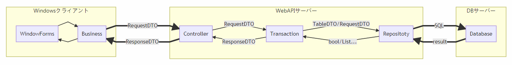

# TinyServerClientFramework
WindowsクライアントとWebAPIサーバーの簡易フレームワーク

# フレームワーク概要  
    
 ## Windowsクライアント  
   ソリューション：Client.sln
   * Client/ClientFramework
     クライアント用フレームワークプロジェクト
   * Client/Client  
     メインプロジェクト(今回はサンプル実装)

 ## WebAPIサーバー  
   ソリューション：WebAPI.sln
   * WebAPI/WebAPIFramework  
     WebAPI用フレームワークプロジェクト
   * WebAPI/WebAPI  
     メインプロジェクト(今回はサンプル実装)
 
 ## DTO  
   **※WindowsクライアントとWebAPIサーバー両方で利用する**  
   ソリューション：なし
   * DataTransferObjectsプロジェクト
     * Request  
       Request用DTO
     * Response  
       Responset用DTO
     * Tables  
       テーブル用DTO  
       ※TableDTOGeneratertツールにて自動生成
